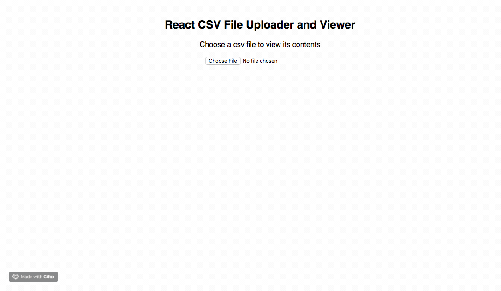

# react-csv-viewer

[](https://github.com/ellerbrock/open-source-badges/)

[![NPM version][npm-image]][npm-url]
[![npm download][download-image]][download-url]
![last commit][last-commit-image]
![Repo size][repo-size-image]
![Github Top Language][language-image]

Super easy csv uploader and viewer component for ReactJS



## Install

> **Note:** Make sure that you have installed the correct version of `react(>= v16.8.0)` and `react-dom(>= v16.8.0)`.

### npm

```bash
npm install --save react-csv-viewer
```

### yarn

```bash
yarn add react-csv-viewer
```

## Demo

[Example](https://codesandbox.io/s/31nm1p6jv1) &emsp;&emsp; [Live Demo](https://31nm1p6jv1.codesandbox.io/)

## Usage

### import Csv Viewer

```js
import CsvViewer from "react-csv-viewer";
```

```js
<CsvViewer />
```

## Contribution

### Make a PR

[](https://github.com/phaniteja1/react-csv-viewer)

## Development

> Node >= v8 LTS

- Clone the project to local disk
- `npm install`
- `npm start`

## License

[](https://opensource.org/licenses/mit-license.php)

[npm-image]: https://img.shields.io/npm/v/react-csv-viewer.svg?style=flat-square
[npm-url]: https://npmjs.com/package/react-csv-viewer
[download-image]: https://img.shields.io/npm/dm/react-csv-viewer.svg?style=flat-square
[download-url]: https://npmjs.com/package/react-csv-viewer
[language-image]: https://img.shields.io/github/languages/top/phaniteja1/react-csv-viewer.svg?style=flat
[repo-size-image]: https://img.shields.io/github/repo-size/phaniteja1/react-csv-viewer.svg?style=flat
[last-commit-image]: https://img.shields.io/github/last-commit/phaniteja1/react-csv-viewer.svg?style=flat
